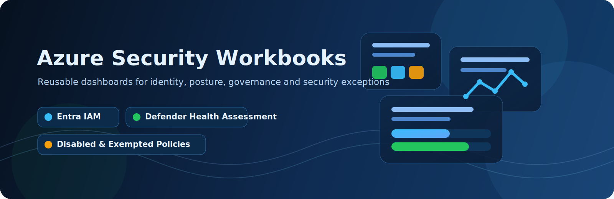
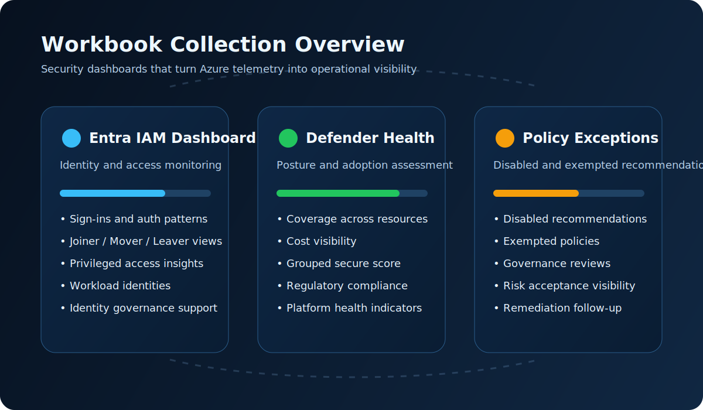
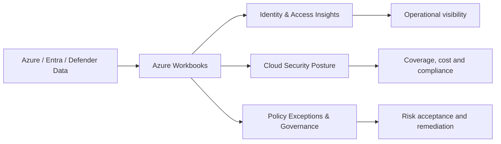

# Azure Security Workbooks

<p align="center">
  
</p>

<p align="center">
  
  
  
  
</p>

A curated collection of **security-focused Azure Workbooks** designed to improve visibility across **identity, cloud posture, governance, and policy hygiene**.

These workbooks help security teams, cloud administrators, and architects turn Azure and Defender data into practical insights for monitoring, assessment, and decision-making.

---

## Why this repository

Azure provides a huge amount of security and operational data, but finding the right view for the right audience often takes time. This repository brings together reusable workbook templates that help you:

- strengthen visibility into **identity and access management**
- assess the health and coverage of **Microsoft Defender for Cloud**
- identify **disabled or exempted security recommendations**
- support governance conversations with stakeholders using clear dashboards
- accelerate workbook deployment and reuse across environments

---

## Included workbooks

### 1. Entra IAM Dashboard
A comprehensive workbook focused on **identity and access management** across Microsoft Entra.

**Highlights**
- Sign-in trends and authentication insights
- Joiner / Mover / Leaver indicators
- Privileged access visibility
- Workload identity insights
- Role and identity-related monitoring views

**Best suited for**
- Identity teams
- Security operations
- Cloud security architects
- Governance and audit stakeholders


---

### 2. Defender for Cloud Health Assessment
A workbook that provides an assessment of your **Microsoft Defender for Cloud** implementation and operational health.

**Highlights**
- Coverage across subscriptions and resources
- Cost visibility
- Grouped Secure Score views
- Regulatory compliance insights
- General platform health and adoption signals

**Best suited for**
- Cloud security teams
- Platform teams
- Security architects
- Management reporting

---

### 3. Defender for Cloud Disabled and Exempted Policies
A workbook that provides an overview of **disabled** or **exempted** security recommendations and policies.

**Highlights**
- Disabled recommendations
- Exempted policies and findings
- Exception visibility for governance reviews
- Support for remediation and risk acceptance tracking

**Best suited for**
- Security governance teams
- Compliance stakeholders
- Platform owners
- Risk managers

---

## Repository structure

```text
.
├── Entra IAM Dashboard
├── Defender for Cloud Health Assessment
├── Defender for Cloud Disabled and Exempted Policies
└── assets
```

---

## Visual overview

<p align="center">
  
</p>



---

## Typical use cases

- Build a reusable **security reporting layer** for Azure
- Support **security reviews** and architecture discussions
- Improve visibility for **IAM governance**
- Track **Defender for Cloud** maturity and adoption
- Review and challenge **security exceptions**
- Provide management with concise, visual security dashboards

---

## Getting started

1. Deploy or import the workbook templates into Azure Monitor / Azure Workbooks.
2. Connect the workbooks to the required data sources.
3. Adjust parameters, subscriptions, or queries where needed.
4. Use the dashboards as a starting point for your own environment-specific reporting.

---

## Data sources

Depending on the workbook, typical data sources can include:

- Azure Resource Graph
- Microsoft Entra sign-in logs
- Azure Activity Logs
- Log Analytics workspaces
- Microsoft Defender for Cloud data
- Azure Policy / Policy Insights

---

## Who this is for

This repository is intended for:

- Azure security architects
- Cloud security engineers
- IAM specialists
- SOC and SecOps teams
- Governance, risk, and compliance professionals
- Managed service and consulting teams

---

## Roadmap ideas

Potential additions for this repository:

- Secure Score deep-dive dashboards
- Identity Protection insights
- PIM and privileged role analytics
- Regulatory mapping views
- Defender cost optimization dashboards
- Workbook screenshots and sample outputs

---

## Contributing

Feedback, ideas, and improvements are welcome.  
Feel free to open an issue or submit a pull request to improve the workbooks or documentation.

---

## Disclaimer

These workbooks are provided as-is and may require adaptation to match your environment, data availability, and security requirements.
