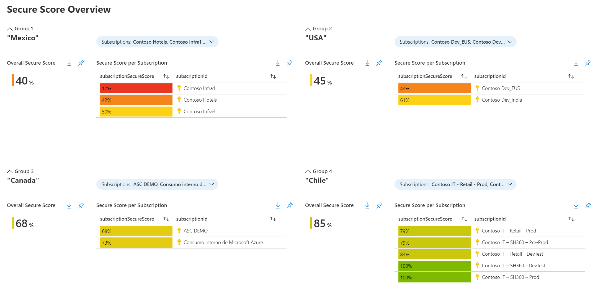

# MCSB Secure Score by Groups

This workbook displays the Defender for Cloud overall Secure Score of groups of subscriptions. By default, it will load four groups; in each of them, you select the subscriptions that represent a group. The group are by default classified in OTAP, but you can change it to your preference.

To deploy the workbook you will need **writing permissions** in the subscription where it will be stored. To view the information, you will need **reader permissions** of all subscriptions that are in the defined groups. 

## Try on Portal
You can deploy the workbook by clicking on the buttons below:

